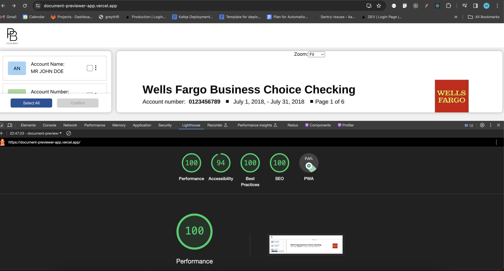

# Project Overview
This project is a ReactJS application aimed at facilitating document processing by providing a user interface to select and highlight specific fields in a document preview.

# Project Structure
The project structure consists of the following main files and directories:

1.App.js: This file serves as the main entry point for the React application. It renders the header component and the main content container, including the form section and document previewer components.

2.FormSection.js: This component represents the form section where users can interact with the document fields, select them, and confirm their selection. It includes functionalities for selecting/deselecting fields, displaying field labels, and managing user interactions.

3.DocumentPreviewer.js: This component displays the document preview with highlighted areas corresponding to the selected fields. It takes a source image and highlight positions as props and renders the document preview accordingly.

4.Header.js: This component represents the header section of the application, displaying the logo or any relevant branding.

5.Popup.js: This component implements a popup modal for confirmation and success messages. It provides feedback to users regarding their actions within the application.

6.utils.js: This file contains utility functions used within the application, such as generating random colors and extracting initials from labels.

# Application Flow
Upon loading the application, users are presented with a header section containing the application logo. The main content area is divided into two sections: the left section displays the form section component, allowing users to select fields from a list, and the right section displays the document previewer component, showing the selected fields highlighted within the document.

Users can interact with the form section to select individual fields or use the "Select All" button to choose all available fields. After selecting the desired fields, users can confirm their selection, triggering a confirmation popup. Upon confirmation, a success popup is displayed, indicating that the fields have been processed successfully.

# Setup and Usage
To run this project locally, follow these steps:

Clone the repository to your local machine.
Navigate to the project directory.
Install dependencies using `npm install` or `yarn install`.
Start the development server with `npm start` or `yarn start`.
Access the application in your web browser at [http://localhost:3000].

# Build
The `npm run build` command is used to build the application for production deployment. When executed, it generates a production-ready build of the application within the build folder.

# Build Process Overview:
React is bundled in production mode to optimize performance.
The build process includes minification of code to reduce file sizes.
Filenames are appended with hashes for cache-busting purposes, ensuring efficient caching strategies.
The resulting build is fully optimized and ready to be deployed to a production environment.
# Deployment:
Once the build process is complete, the generated build files in the `build` folder can be deployed to a web server or hosting service to make the application available to users. This command ensures that the application is prepared for deployment with the best performance optimizations in place.
# Dependencies
This project relies on ReactJS and various packages from the React ecosystem. All dependencies are listed in the package.json file.

# Lighthouse Stats

# Contributors
This project was developed by Pooja Bisht
